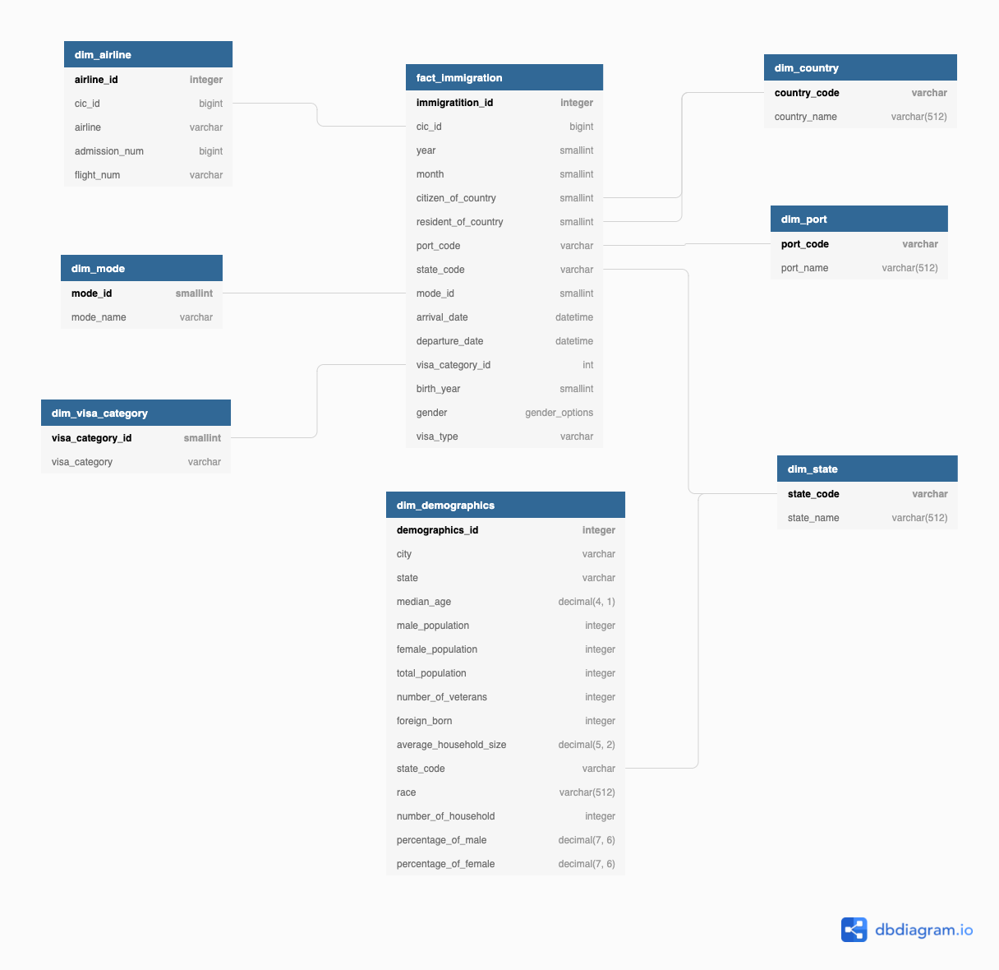

# Data Engineer Capstone Project

## Scope the Project and Gather  Data

### Dataset

- **I94 Immigration Data:** This data comes from the US National Tourism and Trade Office. A data dictionary is included in the workspace. [This](https://travel.trade.gov/research/reports/i94/historical/2016.html) is where the data comes from. There's a sample file so you can take a look at the data in csv format before reading it all in. You do not have to use the entire dataset, just use what you need to accomplish the goal you set at the beginning of the project.
- **U.S. City Demographic Data:** This data comes from OpenSoft. You can read more about it [here](https://public.opendatasoft.com/explore/dataset/us-cities-demographics/export/).

## Explore and Access the data

###  Immigration data

- Fact Immigration
  1. Select columns which are used by fact_immigration
  2. Change column names
  3. Check missing values of all columns
  4. Convert float columns to integer
  5. Process missing value of gender field
  6. Convert SAS date format to datetime format
  7. Visualize exploring results
- Dim Airline data
  1. Select columns which are used by dim_airline
  2. Change column names
  3. Check missing values of all columns
  4. Visualize. exploring result

### demographics data

- Dim Demographics
  1. Select columns which are used by dim_demographics
  2. Change column names
  3. Check missing value of all columns
  4. Generate new columns
  5. Visualize, explore results

More detail data clearning and visualization result refer to [`capstone_project.ipynb`](./capstone_project.ipynb)

## Data Model

#### Define data model



#### Data Dictionary

- fact_immigration

| Column Name         | Data Type           | Description                                                  |
| ------------------- | ------------------- | ------------------------------------------------------------ |
| immigration_id      | serial ,primary key | primary key                                                  |
| cic_id              | bigint              | cic id                                                       |
| year                | smallint, not null  | 4 digit year                                                 |
| month               | smallint, not null  | numeric month                                                |
| citizen_of_country  | smallint            | country of citizenship(i94cit)                               |
| resident_of_country | smallint            | country of residence(i94res)                                 |
| port_code           | varcher             | three character abbreviation for U.S.A port                  |
| state_code          | varcher             | two character abbreviation for U.S.A state                   |
| mode_id             | smallint            | how to arrival to the USA                                    |
| arrival_date        | date                | the arrval date from the USA                                 |
| departure_date      | date                | the departure date from the USA                              |
| visa_category_id    | int                 | the id indicate the different way to come to U.S.A           |
| birth_year          | smallint            | year of birth                                                |
| gender              | Enum                | non-immigrant sex                                            |
| visa_type           | varchar             | class of admission legally admitting the non-immigrant to temporarily stay in U.S. |

- dim_airline

| Column Name   | Data Type                | Description                                    |
| ------------- | ------------------------ | ---------------------------------------------- |
| airline_id    | int                      | primary key                                    |
| cic_id        | bigint, unique, not null | cic id                                         |
| airline       | varchar, not null        | airline used to arrive in U.S                  |
| admission_num | bigint                   | admission Number                               |
| flight_num    | varchar                  | flight number of Airline used to arrive in U.S |

- dim_mode

| Column Name | Data Type         | Description      |
| ----------- | ----------------- | ---------------- |
| mode_id     | int               | primary key      |
| mode_name   | varchar, not null | the name of mode |

- dim_visa_category

| Column Name      | Data Type         | Description              |
| ---------------- | ----------------- | ------------------------ |
| visa_category_id | smallint          | primary key              |
| visa_category    | varchar, not null | the category of the visa |

- dim_demographics

| Column Name            | Data Type    | Description                                                  |
| ---------------------- | ------------ | ------------------------------------------------------------ |
| demographics_id        | int          | primary key                                                  |
| city                   | varchar      | the name of the city                                         |
| state                  | varchar      | the name of the country                                      |
| median_age             | numeric(4,1) | the median age of the city                                   |
| male_population        | int          | the male population of the city                              |
| female_population      | int          | the female population of the city                            |
| number_of_veterans     | int          | the number of veterans in the city                           |
| foreign_born           | int          | the number of foreign born in the city                       |
| average_household_size | numeric(5,2) | the average of household size                                |
| state_code             | varchar      | two character abbreviation for U.S.A state                   |
| race                   | varchar(512) | A race is a grouping of humans based on shared physical or social qualities into categories generally viewed as distinct by society. |
| number_of_household    | int          | the number of household in the city                          |
| percentage_of_male     | numeric(7,6) | the percentage of male of the city                           |
| percentage_of_female   | numeric(7,6) | the percentage of female of the city                         |

- dim_port

| Column Name | Data Type              | Description                                  |
| ----------- | ---------------------- | -------------------------------------------- |
| port_code   | varchar, primary key   | three characters abbreviation for U.S.A port |
| port_name   | varchar(512), not null | the name of port                             |

- dim_country

| Column Name  | Data Type              | Description             |
| ------------ | ---------------------- | ----------------------- |
| country_code | varchar, primary key   | country code            |
| country_name | varchar(512), not null | the name of the country |


#### Data Quality Check

- Check the status of the ETL process. In this project, we just check whether data successfully insert to each table. More detail can refer to [`data_check.py`](./data_check.py) 

  ```bash
  python data_check.py
  ```

## Project Structure

 ```ASII
 ├── Capstone\ Project\ Template.ipynb
 ├── I94_SAS_Labels_Descriptions.SAS
 ├── capstone_project.ipynb
 ├── config.cfg
 ├── create_tables.sql
 ├── data_check.py
 ├── dataset/
 ├── errors.py
 ├── etl.py
 ├── images/
 ├── requirements.txt
 ├── sql_queries.py
 └── utils.py
 ```

- `Capstone Project Template.ipynb`: The project template provide by Udacity
- `I94_SAS_Labels_Descriptions.SAS`: The description of each column of immigration data
- `capstone_project.ipynb`: It records detailed steps of data cleaning, data exploration, and data visualization
- `config.cfg`: The configuration of the project
- `create_tables.sql`: The file records the SQL statement, which uses to create the tables that we need in the project.
- `data_check.py`: The file is responsible for executing data quality check to ensure all ETL jobs run successfully 
- ` datset`: The folder contains the all data which were being used in the dev environment of the project. When the project runs in the production environment, the data source of immigration data will point to another place to load.
- `errors`: Customize exception to handle the errors.
- `etl.py`: The file records the detailed steps of whole ETL jobs.
- `images`: It contains the images, which were used by `README.md` file.
- `requirements.txt`: It records what packages we need in this project, and it also record their specific version.
- `sql_queries.py`:  The file records the SQL statements that we need to be used in this project.
- `utils.py`: The file offers the utility function to the other scripts used. 

## How to Execute the Project ?

Before executing the project, you need to ensure the [PostgresSQL](https://www.postgresql.org/) had been set up. Here is an [installation tutorial](https://www.codementor.io/@engineerapart/getting-started-with-postgresql-on-mac-osx-are8jcopb) for Mac user. After the PostgreSQL set up, you need to fill the specific information of `config.cfg` file then execute `etl.py`. There is one thing you need to notice. When you execute `etl.py` with different argument, the data source will point to different place to load immigration data. 

- Do ETL jobs on sample immigration data with csv format

  ```bash
  python etl.py
  ```

  or 

  ```bash
  python etl.py --data sample
  ```

- Do ETL jobs on original immigration data with sas7bdat format

  ```bash
  python etl.py --data raw
  ```

After executing the project, the console output shows which ETL task is successful, and how much time is being used. The output is just like the following:


## Complete Project Write Up

#### Tools and Technology

- [Pandas](https://pandas.pydata.org/): It is used to data processing and visualization.
- [Jupyter Lab](https://jupyterlab.readthedocs.io/en/latest/): Jupyter lab is an interactive development environment. It's commonly used to data exploration and data visualization. 
- [PostgresSQL](https://www.postgresql.org/): It's used to save data after data processing.
- [PySpark](http://spark.apache.org/docs/latest/api/python/): If data is really huge, pandas isn't a best choice to data processing. Instead of Pandas, PySpark is an interface for Apache Spark in Python. It not only allows you to write Spark applications using Python APIs, but also provides the PySpark shell for interactively analyzing your data in a distributed environment.
- [Airflow](https://airflow.apache.org/docs/apache-airflow/stable/index.html): If it's in the production environment, it needs to a robust workflow management system. Airflow is a platform to programmatically author, schedule and monitor workflows.

#### Data Update Frequency

- The I94 data described immigration events aggregated on a monthly base. Thus, updating the data on a monthly base is recommended.
- All table should be updated append-only mode.

#### How to handle it when below scenarios occur?

- The data was increased by 100x.
  - Use Spark to process data efficiently in distributed way, eg: AWS EMR cluster.
- The data populates a dashboard that must be updated on a daily basis by 7am every day.
  - Use Airflow to manage all data pipeline. Airflow has an easy-to-use interface, let user know the status of the data pipeline.
- The database needed to be accessed by 100+ people.
  - Use AWS RDS instance or AWS Redshift as a data warehouse. Both AWS RDS and Redshift offer the easy way to scale, it can let us handle the peak time.  

## How to use the schema?

- How many number of immigration in the different states each year and how to related to demographics data?

  ```sql
  select * 
  from(
      select
          year,
          state_code,
          count(state_code) as immigration_num
      from fact_immigration 
      group by year, state_code
  ) group_im
  join (
      select state_code,
          round(avg(median_age), 2) as median_age,
          round(avg(male_population), 2) as male_population,
          round(avg(female_population), 2) as female_population,
          round(avg(total_population), 2) as total_population,
          round(avg(number_of_veterans), 2) as number_of_veterans,
          round(avg(foreign_born), 2) as foreign_born,
          round(avg(average_household_size), 2) as average_household_size,
          round(avg(number_of_household), 2) as number_of_household,
          round(avg(percentage_of_male), 2) as percentage_of_male,
          round(avg(percentage_of_female), 2) as percentage_of_female
      from dim_demographics
      group by state_code
  ) group_dd
  on group_im.state_code = group_dd.state_code;
  ```

- Which airline is most used for coming to the USA in the different states each year?

  ```sql
  select 
      fi.year as year,
      fi.state_code as state_code,
      da.airline as airline,
      count(airline) as count_airline
  from fact_immigration fi
  join dim_airline da
  on fi.cic_id = da.cic_id
  group by fi.year, fi.state_code, da.airline
  order by state_code, count(airline) desc;
  ```
