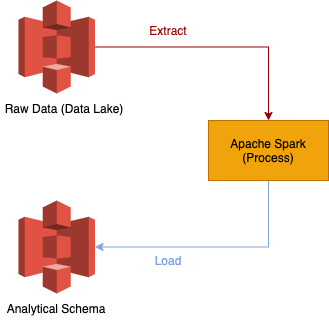
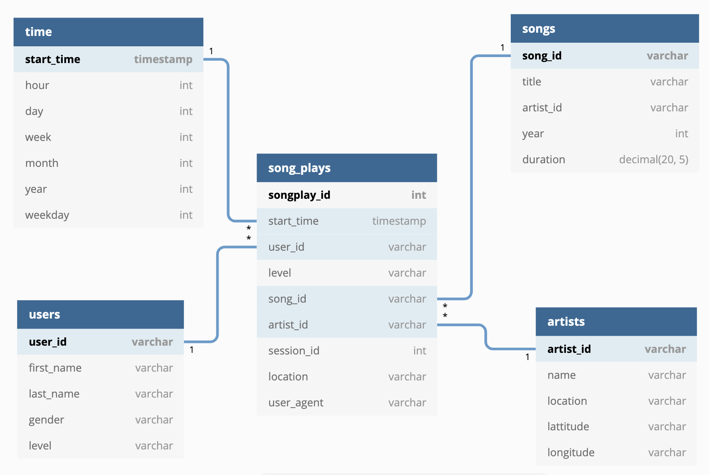

# Project: Data Lake

----

### Introduction

A music streaming startup, Sparkify, has grown their user base and song database even more and want to move their data warehouse to a data lake. Their data resides in S3, in a directory of JSON logs on user activity on the app, as well as a directory with JSON metadata on the songs in their app.

As their data engineer, you are tasked with building an ETL pipeline that extracts their data from S3, processes them using Spark, and loads the data back into S3 as a set of dimensional tables. This will allow their analytics team to continue finding insights in what songs their users are listening to.

You'll be able to test your database and ETL pipeline by running queries given to you by the analytics team from Sparkify and compare your results with their expected results.

### Project Description

In this project, you'll apply what you've learned on Spark and data lakes to build an ETL pipeline for a data lake hosted on S3. To complete the project, you will need to load data from S3, process the data into analytics tables using Spark, and load them back into S3. You'll deploy this Spark process on a cluster using AWS.

## Project Datasets
---

You'll be working with two datasets that reside in S3. Here are the S3 links for each:

- Song data: `s3://udacity-dend/song_data`
- Log data: `s3://udacity-dend/log_data`

### Song Dataset

The first dataset is a subset of real data from the [Million Song Dataset](https://labrosa.ee.columbia.edu/millionsong/). Each file is in JSON format and contains metadata about a song and the artist of that song. The files are partitioned by the first three letters of each song's track ID. For example, here are filepaths to two files in this dataset.

```
song_data/A/B/C/TRABCEI128F424C983.json
song_data/A/A/B/TRAABJL12903CDCF1A.json
```

And below is an example of what a single song file, TRAABJL12903CDCF1A.json, looks like.

```json
{"num_songs": 1, "artist_id": "ARJIE2Y1187B994AB7", "artist_latitude": null, "artist_longitude": null, "artist_location": "", "artist_name": "Line Renaud", "song_id": "SOUPIRU12A6D4FA1E1", "title": "Der Kleine Dompfaff", "duration": 152.92036, "year": 0}
```

### Log Dataset

The second dataset consists of log files in JSON format generated by this [event simulator](https://github.com/Interana/eventsim) based on the songs in the dataset above. These simulate app activity logs from an imaginary music streaming app based on configuration settings.

The log files in the dataset you'll be working with are partitioned by year and month. For example, here are filepaths to two files in this dataset.

```
log_data/2018/11/2018-11-12-events.json
log_data/2018/11/2018-11-13-events.json
```

## System Architecture

----

### Data Flow

- Extract data from data lake to Spark for transforming data, and then save data into analytical schema. Both data lake and analytical table are AWS S3.

<p align="center">
    
</p>

### Analytical Table

| table name | property        | source           | usage                                                        | partition key   |
| ---------- | --------------- | ---------------- | ------------------------------------------------------------ | --------------- |
| song_plays | fact table      | log_data + songs | Saving user log data from logs_data, which associated with songs data | year, month     |
| songs      | dimension table | song_data        | Saving songs data from song_data.                            | year, artist_id |
| artists    | dimension table | song_data        | Saving artist data from song_data.                           |                 |
| time       | dimension table | log_data         | Saving time data from log data.                              | year, month     |
| users      | dimension table | log_data         | Saving user data from log data.                              |                 |

<p align="center">
    
</p>

## Project Structure

----

There are two folder and three files in the project. Each folder and file has different usage as following description.

- `data/`: It contains two zip files, one is log-data.zip and the other is song-data.zip. The data is used to test the data pipeline whether is correct or not. If the pipeline is correct, we can move the pipeline to the bigger dataset.

- `img/`: It saves the images which are used for `README.md`.
- `dl.cfg`: It records the configurations of the project. For now, it just contains  `AWS_ACCESS_KEY_ID` and `AWS_SECRET_ACCESS_KEY`.
- `etl.py`: It is responsible for executing ETL processing. The process is separated into three steps, the first step is to extracting data from data lake (S3 bucket), the seond step is to transforming data by Spark, and the last step is to writing data back to analytical tables(S3 bucket). The data-flow was showed on system architectiure section.

- `utils.py`: It offers the utility functions that the other scripts use.

## How to execute the project?

----

#### Setting Enviroment

Before executing the project, you can choose your project extract data and write back data on local side or cloud side. Both the local side and cloud side have some setting that need to be set.

- Cloud:

  - You need to have `IAM role` , which has enough permission to create and access `S3 bucket`.

- Local:

  - It needs to create a folder under the `./data` and unzip the files into `./data`. After transforming the data, it also needs a folder to save the results, so creating the  `./output` folder and five new folders under the `/output` to save the results.  The instruction show as blow:

  ```bash
  # Extract raw data folder
  mkdir ./data/log_data ./output ./output/songs ./output/artists ./output/song_plays ./output/time ./output/users
  tar -xvf ./data/log-data.zip -C ./data/log_data/
  tar -xvf ./data/song-data.zip -C ./data/
  ```

#### Executing Steps

- Fill the `AWS_ACCESS_KEY_ID` and `AWS_SECRET_ACCESS_KEY` on `dl.cfg`

- Fill the `input_data` and `output_data` on `elt.py`, which can be `S3 bucket URI` or `local path`.

- Execute `etl.py` to do ETL jobs.

  ```bash
  python etl.py
  ```

  
