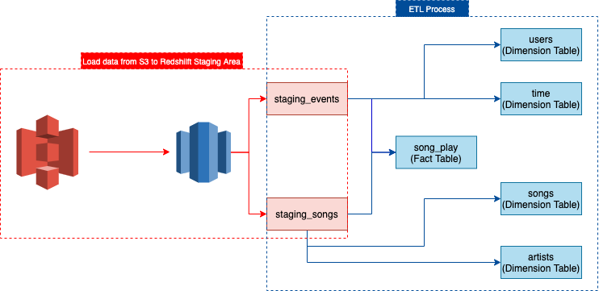
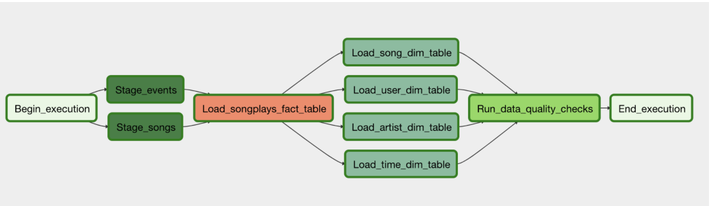
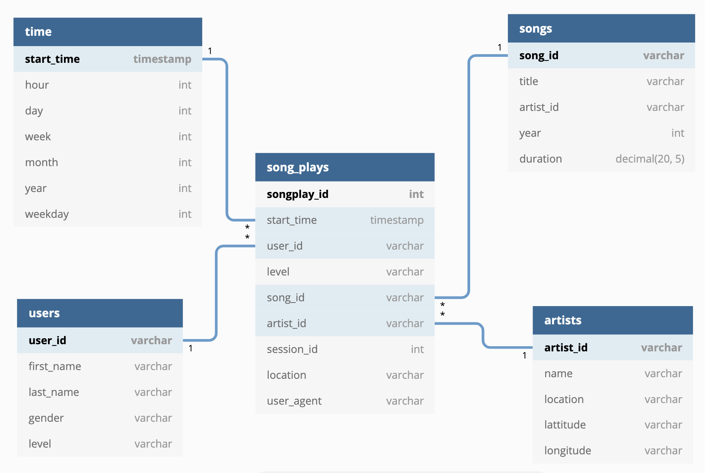
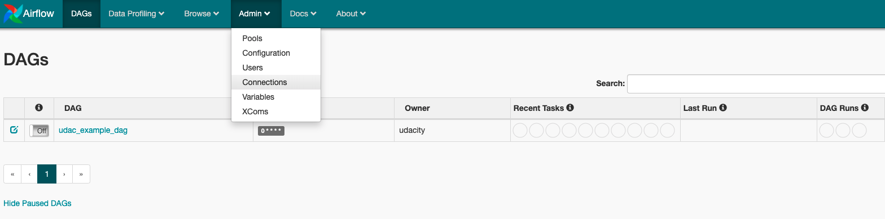

# Project: Data Pipelines with Airflow

A music streaming company, Sparkify, has decided that it is time to introduce more automation and monitoring to their data warehouse ETL pipelines and come to the conclusion that the best tool to achieve this is Apache Airflow.

They have decided to bring you into the project and expect you to create high grade data pipelines that are dynamic and built from reusable tasks, can be monitored, and allow easy backfills. They have also noted that the data quality plays a big part when analyses are executed on top the data warehouse and want to run tests against their datasets after the ETL steps have been executed to catch any discrepancies in the datasets.

The source data resides in S3 and needs to be processed in Sparkify's data warehouse in Amazon Redshift. The source datasets consist of JSON logs that tell about user activity in the application and JSON metadata about the songs the users listen to.


## Data Flow

- Load data from S3 to Redshift staging table, and then do ETL process to load data to fact and dimension tables. The data flow show as following figure.



## Write Data Flow as [Airflow DAG](https://airflow.apache.org/docs/apache-airflow/1.10.12/concepts.html). 

-  The above data flow can be separated into 4 steps and each step can be converted into [Airflow Task](https://airflow.apache.org/docs/apache-airflow/stable/concepts/tasks.html).
  1. Load data from S3 to Redshift `staging tables`.
  2. Load data from `staging tables` to `fact table`.
  3. Load data from `fact table` to `dimension tables`.
  4. Check the data quality of `dimension tables`.




## Datasets

For this project, you'll be working with two datasets. Here are the s3 links for each:

- Log data: `s3://udacity-dend/log_data`
- Song data: `s3://udacity-dend/song_data`

It also has a column mapping file on S3, which used for mapping staging_events table.

- staging_event_column_mapping: `s3://udacity-dend/log_json_path.json`

  

## Analytical Table

| table name | property        | source                        | usage                                                        |
| ---------- | --------------- | ----------------------------- | ------------------------------------------------------------ |
| songplays  | fact table      | staging_event + staging_songs | Saving user log data from logs_data, which associated with songs data |
| songs      | dimension table | staging_song                  | Saving songs data from song_data.                            |
| artists    | dimension table | staging_song                  | Saving artist data from song_data.                           |
| time       | dimension table | staging_event                 | Saving time data from log data.                              |
| users      | dimension table | staging_event                 | Saving user data from log data.                              |




## Project Structure

- The project strucutre show as below:

```ANSI
airflow-project
+-- dags
|   +-- udac_example_dag.py
+-- plugins
|   +-- __init__.py
|   +-- helpers
|   +-- operators
+-- requirements.txt
+-- add-conn.sh
+-- reset-env.sh
+-- start-server.sh
+-- stop-server.sh
```

- `dags`: The directory puts all dag files, which are executed by Airflow.

- `plugins`: The directory contains two folders, one is `helps`, which puts utilties modules and functions. Another one is `operators`, which contains customized operators for handling specific tasks.

- `requirements.txt`: It records what packages you need and which version you need to specify for setting the environment. 

- `add-conn.sh`: It's used as a utility function for adding connection information to airflow metadb. If you want to add new connection info by this script,  you just need to add new connection info into add_conn function, and its format is referred from `airflow cli`. More about *[airflow cli](https://airflow.apache.org/docs/apache-airflow/stable/cli-and-env-variables-ref.html)*.

  - How to use airflow connnection cli ? 

    ```bash
    airflow connections --help
    ```

- `reset-env.sh`: It's used as a utility function for removing directory and files, which are genreated by airflow.

- `start-server.sh`: Start airflow server as daemon with *[SequentialExecutor](https://airflow.apache.org/docs/apache-airflow/stable/executor/sequential.html)* . Under the executor, it also needs to start two components `webserver` and `scheduler`.  It also can add argument `--add-conn` to run this script, it will invoke `add-conn.sh` to add connection informaton to airflow metadb.

  ```bash
  bash start-server.sh --add-conn
  ```

- `stop-server.sh`: Stop airflow server. It also can add argument `--reset-env` to run this script, it will invoke `reset-env.sh`.  More about *[how to stop airflow server](https://stackoverflow.com/questions/65656254/how-to-kill-airflow-scheduler-and-webserver)*.

  ```bash
  bash stop-server.sh --reset-env
  ```

- ***Notice Airflow version, the version of airflow after 2.0 has a lot of changes between 1.XX***


## How to run this project ?

Before running this project, you need an AWS account and create `AWS USER`,  `IAM role` and `redshift` cluster .  Note that the `IAM role` should have enough permission to access S3 bucket and Redshift. After above steps, you need to set environment variable `AIRFLOW_HOME` to point the path that you want to execute airflow. 

```bash
export AIRFLOW_HOME="airflow-project-path"
```

Note that the variable `AIRFLOW__CORE__FERNET_KEY` should be consistency. The variable is used for encrypting . If password. it isn't consistency, the ariflow will raise error. So I suggest set `AIRFLOW__CORE__FERNET_KEY` as environment variable. More about [how to set airflow configuration](https://airflow.apache.org/docs/apache-airflow/stable/howto/set-config.html)

- How to generate unique `Fernet key` ? More about *[Fernt key](https://airflow.apache.org/docs/apache-airflow/stable/security/secrets/fernet.html)*.

  ```python
  from cryptography.fernet import Fernet
  fernet_key= Fernet.generate_key()
  print(fernet_key.decode()) # your fernet_key, keep it in secured place!
  ```

- Set `Fernet key` as  environment variable

  ```bash
  export AIRFLOW__CORE__FERNET_KEY="key"
  ```

 There are three way to add connection information to airflow metadb.

1. Use Airflow UI. If you chose this way, you need to start server at first. Run below command on your terminal then add connection information by airflow UI.

   ```bash
   bash start-server.sh
   ```

   


2. Use Airflow CLI , the Airflow CLI format and start server as following:

   ```bash
   # Start airflow server
   bash start-server.sh
   
   # Add Redshift connection information
   airflow connections --add --conn_id ${DB_CONN_ID} --conn_type ${DB_TYPE}\
           --conn_host ${DB_HOST} --conn_port ${DB_PORT} --conn_schema ${DB_NAME}\
           --conn_login ${DB_USER} --conn_password ${DB_PASSWORD}
   
   # Add AWS credentials
   airflow connections --add --conn_id ${credential_id} --conn_type "Amazon Web Services"\
           --conn_login ${AWS_ACCESS_KEY_ID} --conn_password ${AWS_SECRET_ACCESS_KEY}
   
   ```

3. Use `add-conn.sh`. Write `airflow connections cli` into `add-conn.sh` then execute `start-server.sh` with argument `--add-conn`. In this way, it will automatically add connection information to airflow metadb after starting server.

   ```bash
   bash start-server.sh --add-conn
   ```
