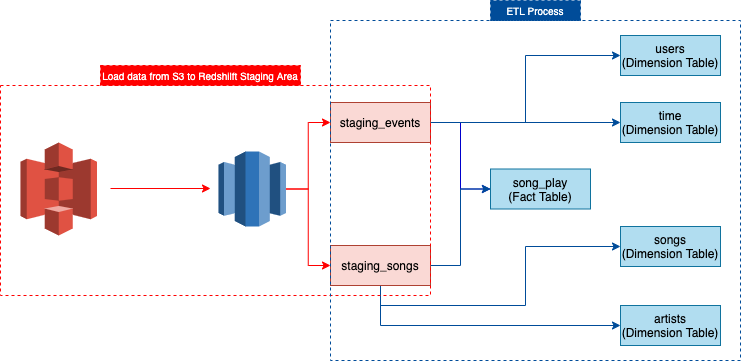

# Project: Data Warehouse

## Introduction
A music streaming startup, Sparkify, has grown their user base and song database and want to move their processes and data onto the cloud. Their data resides in S3, in a directory of JSON logs on user activity on the app, as well as a directory with JSON metadata on the songs in their app.

As their data engineer, you are tasked with building an ETL pipeline that extracts their data from S3, stages them in Redshift, and transforms data into a set of dimensional tables for their analytics team to continue finding insights in what songs their users are listening to. You'll be able to test your database and ETL pipeline by running queries given to you by the analytics team from Sparkify and compare your results with their expected results.

## Project Description
In this project, you'll apply what you've learned on data warehouses and AWS to build an ETL pipeline for a database hosted on Redshift. To complete the project, you will need to load data from S3 to staging tables on Redshift and execute SQL statements that create the analytics tables from these staging tables.

## Data Flow

The data flow can be separated into two steps. The first step is to load data from S3 bucket to Redshift staging area, and the second step is to do ETL process from staging area to analyical tables.

```flow
s3=>operation: S3 Bucket
redshift_staging_area=>operation: Redshift Staging Area
start_schema=>operation: Start Schema

s3(right)->redshift_staging_area(right)->start_schema
```

The detail data flow show as follow:



## Tables

There are 7 tables in total, two of them are for saving staging data which are from S3 bucket, and the others are for saving analytical data. 

### Staging Tables

| table name     | usage                             |
| -------------- | --------------------------------- |
| staging_events | Save user log data from S3 bucket |
| staging_songs  | Save songs data from S3 bucket    |

### Analytical Tables

| table name | property        | usage                                                      |
| ---------- | --------------- | ---------------------------------------------------------- |
| song_play  | Fact Table      | Saving user log data from staging_events and staging songs |
| artists    | Dimension Table | Saving artists data from staging_songs                     |
| songs      | Dimension Table | Saving songs data from staging_songs                       |
| users      | Dimension Table | Saving user data from staging_events                       |
| time       | Dimension Table | Saving time data from staging_events                       |

## Table Schema

### Staging Tables Schema:

- Staging_events

| column_name   | data_type      |
| ------------- | -------------- |
| artist        | varchar        |
| auth          | varchar        |
| firstName     | varchar        |
| gender        | char(1)        |
| itemInSession | int            |
| lastName      | varchar        |
| length        | numeric(20, 5) |
| location      | varchar        |
| method        | varchar        |
| page          | varchar        |
| registration  | numeric        |
| sessionId     | varchar        |
| song          | varchar        |
| status        | smallint       |
| ts            | timestamp      |
| userAgent     | varchar        |
| userId        | integer        |

- staging_songs

| column_name      | data_type      |
| ---------------- | -------------- |
| song_id          | varchar        |
| title            | varchar        |
| year             | int4           |
| num_songs        | smallint       |
| artist_id        | varchar        |
| artist_name      | varchar        |
| artist_location  | varchar        |
| artist_latitude  | numeric(10, 5) |
| artist_longitude | numeric(10, 5) |
| duration         | numeric(20, 5) |

### Analyctial Tables

- song_play

| column_name  | data_type           |
| ------------ | ------------------- |
| song_play_id | bigint, primary key |
| start_time   | timestamp           |
| user_id      | integer not null    |
| level        | varcahr(16)         |
| song_id      | varcahr(18)         |
| artist_id    | varcahr(18)         |
| session_id   | integer             |
| location     | varcahr(256)        |
| user_agent   | varcahr(512)        |

- artists

| column_name | data_type                         |
| ----------- | --------------------------------- |
| artist_id   | varchar(18), primary key, sortkey |
| name        | varchar(512)                      |
| location    | varchar(512)                      |
| latitude    | numeric(10, 5)                    |
| longitude   | numeric(10, 5)                    |

- songs

| column_name | data_type                         |
| ----------- | --------------------------------- |
| song_id     | varchar(18), primary key, sortkey |
| title       | varchar(256)                      |
| artist_id   | varchar(18)                       |
| year        | samllint                          |
| duration    | numeric(20, 5)                    |

- users

| column_name | data_type                |
| ----------- | ------------------------ |
| user_id     | varchar(18), primary key |
| first_name  | varchar(256)             |
| last_name   | samllint                 |
| gender      | char(1)                  |
| level       | varcahr(16)              |

- time

| column_name | data_type                       |
| ----------- | ------------------------------- |
| start_time  | timestamp, primary key, sortkey |
| hour        | smallint not null               |
| day         | smallint not null               |
| week        | smallint not null               |
| month       | smallint not null               |
| year        | smallint not null               |
| weekday     | smallint not null               |

## Project Structure

There are five files in the project. Each file has different usage.

- `create_table.py` is responsible for creating all db schema. 
- `etl.py` is responsible for doing the ETL process, and it has two steps. The first one is to load data from the S3 bucket to the Redshift staging area, and the second one is to do the ETL process from the staging area to star schema.
- `sql_queries.py` records all SQL statement.
- `dwh.cfg` records the configurations of the project. 
- `utils.py` offers the utility functions that the other scripts use.

## How to execute the project?

Before executing the project, you need to create a Redshift cluster and set its IAM role which has enough permission to access S3 bucket. Here is a [AWS official tutorial](https://docs.aws.amazon.com/redshift/latest/gsg/getting-started.html) that you refer.

- Fill specific information of redshift and IAM Role to `dwh.cfg` 

- Execute `create_table.py` to create all tables. 

  ````bash
  python3 create_table.py
  ````

- Execute `etl.py` to load data from the S3 bucket to the redshift staging area and do ETL process from staging area to analytical tables.

  ```bash
  python3 etl.py
  ```

- It can run the below SQL query to verify whether all queries have successfully executed.

  ```sql
  select 'staging_event' as table_name,
  	count(artist) as row_count
  from staging_events se
  union all (
  	select 'staging_songs' as table_name,
          count(song_id) as row_count
      from staging_songs
  ) 
  union all (
  	select 'song_play' as table_name,
          count(song_play_id) as row_count
      from song_play
  )
  union all (
  	select 'songs' as table_name,
          count(song_id) as row_count
      from songs
  )
  union all (
  	select 'artists' as table_name,
          count(artist_id) as row_count
      from artists
  )
  union all (
  	select 'users' as table_name,
          count(user_id) as row_count
      from users
  ) 
  union all (
  	select 'song_play' as table_name,
          count(start_time) as row_count
      from time
  ) order by row_count desc;
  ```

  

## Example queries

- Find the top 10 popular song, its title and its artist_name in  2018.

  ```sql
  select distinct tt.count_song as count_num, 
  	tt.song_id as song_id,
  	ss.title as song_title,
  	a.name as artist_name
  from song_play sp
  join (
    select count(sp.song_id) as count_song,
    	sp.song_id as song_id
    from song_play sp
    join time t
    on sp.start_time = t.start_time
    where t.year = 2018
    group by sp.song_id
    order by count(sp.song_id) desc
    limit 10
  ) tt
  on sp.song_id = tt.song_id
  join songs ss
  on sp.song_id = ss.song_id
  join artists a
  on sp.artist_id = a.artist_id
  order by tt.count_song desc;
  ```

  

